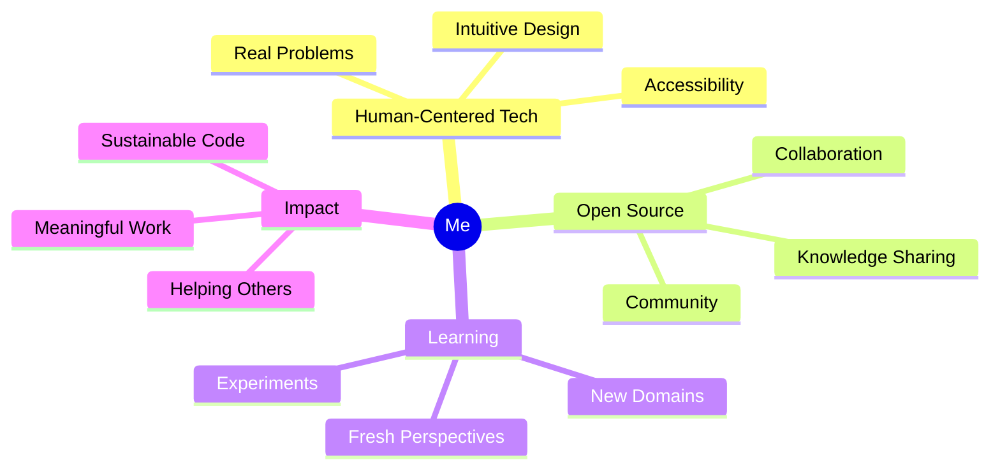

<div align="center">

# 👋 Hey there, I'm a human who codes


---

### 💭 Philosophy

</div>

```ascii
┌─────────────────────────────────────────────────────────┐
│  "Technology should bring us closer to what makes us    │
│   human, not further from it."                          │
└─────────────────────────────────────────────────────────┘
```

<div align="center">

## 🎯 What Drives Me

</div>

<table>
<tr>
<td width="50%">

### 🧠 **Mindset**
> Building things that **matter** over things that **impress**

> **Curiosity** over credentialism

> **Kindness** over cleverness

> **Process** over portfolio

</td>
<td width="50%">

### 🔥 **Current Focus**
- 🎨 Human-centered design
- 🤝 Open collaboration  
- 🌱 Sustainable solutions
- 📢 Learning in public
- 🔍 Asking better questions

</td>
</tr>
</table>

---

<div align="center">

## 🌟 What I'm Interested In

</div>



<div align="center">

## 🚀 Working Toward

</div>

<details>
<summary><b>🎯 Short Term Goals</b></summary>
<br>

- 🧪 Building things that are **genuinely useful**, not just technically interesting
- 💬 Communicating ideas clearly without unnecessary jargon  
- 🗑️ Knowing when to **delete code** instead of adding more
- 🤔 Understanding the **human side** of technical problems

</details>

<details>
<summary><b>🌍 Long Term Vision</b></summary>
<br>

Contributing to a future where technology feels less like a **race** and more like a **conversation**.

Where we measure success by:
- ✨ Problems we solve
- 🤝 People we help  
- 💡 Ideas we share

Not by:
- ❌ Metrics we optimize
- ❌ Complexity we achieve
- ❌ Competition we win

</details>

---

<div align="center">

## 🎨 Current Vibe

</div>

```python
class CurrentMindset:
    def __init__(self):
        self.focus = "intentional creation"
        self.priority = "what will be good" > "what will look good"
        self.approach = "follow curiosity, not checklists"
        self.acceptance = "some days succeed, some don't - that's okay"
    
    def collaborate(self, you):
        if you.values.align_with(self.values):
            return "Let's build something meaningful together! 🚀"
```

---

<div align="center">

### 📊 My Development Philosophy in Numbers


</div>

---

<div align="center">

## 💬 Why I'm Here

> *Every repository is a **conversation***  
> *Every pull request is an **opportunity to learn***  
> *Every issue is a chance to **help or ask for help***

**I'm here to collaborate, not compete.**  
**To explore, not perform.**  
**To build together, not build alone.**

---

### 🤝 Let's Connect

If you believe in building things that matter over things that trend,  
If you value **learning** over looking good,  
If you want to create something **meaningful** together...

**Let's chat.** 💭

---


</div>
